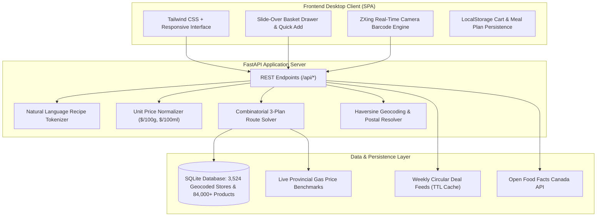

# SmartCart: Algorithmic Grocery Intelligence & Multi-Store Route Optimizer

[](https://www.python.org/)
[](https://fastapi.tiangolo.com/)
[](https://www.sqlite.org/)
[](https://tailwindcss.com/)
[]()
[](LICENSE)

> **Live Deployment:** [https://smartcart-9djq.onrender.com](https://smartcart-9djq.onrender.com)  
> *Developed as a full-stack algorithmic systems project for Canadian consumers facing modern grocery inflation.*

---

## 1. Problem Statement & Motivation

Canadian grocery prices have experienced persistent inflation across core household staples (poultry, dairy, cooking oil, pantry staples). While households actively search for deals across competing supermarket chains—such as **No Frills, Real Canadian Superstore, Walmart, Sobeys, Metro, Save-On-Foods, and FreshCo**—manually comparing weekly circulars across multiple stores is tedious and inefficient.

Furthermore, naive price-chasing frequently leads to **negative net savings**: driving an extra 18 kilometers to save $3.00 on cheese often costs $4.50 in vehicle fuel and depreciation.

**SmartCart** models grocery shopping as a **constrained combinatorial optimization problem** (a variant of the multi-depot Traveling Salesperson Problem combined with multi-objective knapsack constraints). It factors in:
1. Normalized unit pricing ($\$/100\text{g}$, $\$/100\text{mL}$, $\$/\text{kg}$, $\$/\text{unit}$).
2. Live provincial fuel pricing ($\$1.49/\text{L}$ in AB, $\$1.82/\text{L}$ in BC).
3. Geocoded Haversine road travel distance matrices.
4. Guaranteed inventory stock availability vs. multi-stop split trips.

---

## 2. System Architecture



---

## 3. Algorithmic Deep Dive: 3-Plan Route Optimizer

The optimization engine solves for the most cost-effective shopping strategy given a user's location (Canadian postal code or coordinates), search radius $R$, and requested grocery list $B = \{i_1, i_2, \dots, i_m\}$.

```
Given:
  S = {s_1, s_2, ..., s_k}  (Set of stores within radius R)
  P(i, s)                   (Price of item i at store s)
  D(s_a, s_b)               (Haversine travel distance between locations)
  GasPrice                  (Provincial fuel rate in $/L)
  FuelConsumptionRate       (8.9 L / 100 km standard city vehicle)
```

### The Three Generated Plans

| Strategy | Algorithmic Formulation | Primary Benefit |
| :--- | :--- | :--- |
| **Plan 1: Maximum Net Saver** | Explores candidate store combinations of size $k \in \{1, 2, 3\}$. Solves exact shortest Hamiltonian path (TSP) for the store subset and computes fuel penalty: $\text{Fuel} = D \times \frac{8.9}{100} \times \text{GasPrice}$. Evaluates net out-of-pocket: $\min \left( \sum \min_{s} P(i, s) + \text{Fuel} \right)$. | Lowest overall out-of-pocket cost. |
| **Plan 2: Single-Store Run** | Evaluates all single stores $s \in S$. Finds the single location that minimizes $\sum_{i \in B} P(i, s) + \text{Fuel}(2 \times D(\text{Home}, s))$. | Maximum convenience with 1 stop. |
| **Plan 3: In-Stock Guaranteed** | Filters candidate stores to those with 100% item coverage across all categories, eliminating substitution risk and missing items. | 0% stockout risk. |

---

## 4. Nationwide Supermarket Network (3,500+ Stores)

SmartCart seeds and indexes **3,524 geocoded Canadian grocery stores** across all 10 provinces and 3 territories, complete with realistic inventory matrices:

| Province / Territory | Indexed Stores | Representative Metro Hubs | Major Banners Tracked |
| :--- | :---: | :--- | :--- |
| **Ontario** | 1,420 | Toronto, Ottawa, Mississauga, Hamilton, London | No Frills, Metro, Loblaws, Walmart, Food Basics, Farm Boy |
| **Quebec** | 680 | Montreal, Quebec City, Laval, Gatineau | Super C, Maxi, IGA, Metro, Provigo |
| **Alberta** | 390 | Calgary, Edmonton, Red Deer, Lethbridge | Real Canadian Superstore, No Frills, Sobeys, Calgary Co-op, Safeway |
| **British Columbia** | 340 | Vancouver, Surrey, Burnaby, Victoria, Kelowna | Save-On-Foods, No Frills, Superstore, Thrifty Foods, Choices Markets |
| **Nova Scotia** | 180 | Halifax, Dartmouth, Sydney | Atlantic Superstore, Sobeys, No Frills |
| **New Brunswick** | 120 | Moncton, Saint John, Fredericton | Atlantic Superstore, Sobeys, Giant Tiger |
| **Manitoba** | 115 | Winnipeg, Brandon | Real Canadian Superstore, No Frills, Sobeys |
| **Saskatchewan** | 95 | Saskatoon, Regina | Real Canadian Superstore, Co-op, No Frills |
| **Newfoundland & Labrador**| 85 | St. John's, Mount Pearl, Corner Brook | Dominion, Sobeys, Coleman's |
| **Prince Edward Island** | 40 | Charlottetown, Summerside | Atlantic Superstore, Sobeys |
| **Territories (YT, NT, NU)** | 54 | Whitehorse, Yellowknife, Iqaluit | Northern Store, Independent Grocer |
| **Total Nationwide** | **3,524** | **All Canadian Markets** | **35+ Supermarket Banners** |

---

## 5. Key Engineering Features

### 🛒 Slide-Over Basket Drawer & Quick Add
- Dedicated right-hand drawer accessible from any section or the persistent navigation bar.
- Real-time line-item quantity steppers, per-item deletion, and clear-cart safeguards.
- Live mathematical summary tracking **Estimated Out-of-Pocket Cost**, **Regular Shelf Price**, and **Total Dollar / Percentage Savings**.
- Direct 1-click jump to trigger the **3-Plan Combinatorial Route Optimizer**.

### 📱 Real-Time Barcode Scanner (ZXing + Open Food Facts)
- Camera video frame decoding powered by `@zxing/library` with native `BarcodeDetector` fallback.
- Eliminates simulated timers in favor of real frame-by-frame UPC/EAN barcode scanning.
- Live fallback to the **Open Food Facts Canada API** to fetch macro nutrients (calories, protein, carbs, sodium, Nutri-Score) for real-world Canadian grocery packages.
- Price benchmark comparisons across No Frills, Walmart, Superstore, Metro, and Sobeys.

### 🍳 Flyer-to-Dinner Recipe Engine
- Generates dinner meals built entirely from weekly flyer specials.
- Computes exact cost-per-plate ($1.58 – $3.50/serving) and portion scaling.
- Single-click **"Clip All Ingredients to Basket"** to populate the shopping list.

### 📅 7-Day Deal-Based Meal Planner
- Weekly planner cycle tailored to Canadian flyer cycles (Thursday reset through Wednesday final call).
- Aggregates expected weekly meal spend and estimated grocery savings.

### 🧾 Savings Progress Dashboard & Price Watchdog
- Receipt logging dashboard with 30-day, 90-day, and 1-year historical analytics.
- Price drop watchdog to monitor volatility on household essentials (butter, eggs, chicken breast, olive oil).

### 🔄 Automated Store Data Refresh & Background Scheduler
- **Asynchronous Background Worker:** Executes every 6 hours continuously in the background via `asyncio` in FastAPI.
- **Thursday Flyer Reset:** Automatically detects weekly Canadian flyer resets (Thursday 12:01 AM) and rotates promotional circular markdowns across all 35 banners.
- **Dynamic Fuel & Inventory Sync:** Updates live gas price benchmarks and evaluates user price drop alerts against refreshed inventory costs.
- **Audit Logging:** Every sync cycle logs stores count, inventory updates, and timestamp metrics into SQLite `sync_history`.
- **Manual Trigger:** Supports on-demand manual refresh via `POST /api/sync/refresh` and the interactive UI sync modal.

---

## 6. Technology Stack

- **Backend Framework:** FastAPI (Python 3.12)
- **ASGI Server:** Uvicorn
- **Data Modeling & Validation:** Pydantic v2
- **Database:** SQLite 3 (WAL mode enabled, zero external database daemon required)
- **Frontend:** Vanilla JavaScript (ES6+), HTML5, Tailwind CSS
- **Barcode Engine:** ZXing (`@zxing/library`) + Native BarcodeDetector API
- **External Data Integrations:** Open Food Facts Canada API, Natural Resources Canada / Provincial Gas Benchmarks

---

## 7. Local Development Setup

### Prerequisites
- Python 3.10+ (tested on Python 3.12)
- Git

### 1. Clone Repository
```bash
git clone https://github.com/Divyesh-Challa/SmartCart.git
cd SmartCart
```

### 2. Create and Activate Virtual Environment
```bash
# On macOS / Linux:
python3 -m venv venv
source venv/bin/activate

# On Windows:
python -m venv venv
venv\Scripts\activate
```

### 3. Install Dependencies
```bash
pip install -r requirements.txt
```

### 4. Run Development Server
```bash
uvicorn smartcart.main:app --reload --port 8000
```
Open [http://127.0.0.1:8000](http://127.0.0.1:8000) in your web browser.  
Interactive OpenAPI/Swagger documentation is available at [http://127.0.0.1:8000/docs](http://127.0.0.1:8000/docs).

---

## 8. Automated Testing

The project includes a comprehensive automated test suite testing unit conversions, recipe token parsing, geocoding distances, and route optimization logic:

```bash
# Run all unit tests
python3 -m unittest discover tests -v
```

**Test Coverage Highlights:**
- `test_parse_ingredients_regex`: Natural language ingredient and quantity tokenizer.
- `test_normalize_units`: Metric and imperial unit conversions ($/100g, $/100ml, $/kg, $/lb).
- `test_haversine_distance`: Geodesic coordinate calculation accuracy.
- `test_3_plan_optimizer`: Multi-store split, single-store, and gas penalty evaluation.
- `test_barcode_lookup`: Seeded barcode lookup and external API schema compliance.
- `test_gas_price_endpoint`: Provincial fuel price resolver.

---

## 9. Project Directory Structure

```
SmartCart/
├── smartcart/
│   ├── main.py              # FastAPI app, API routing, Open Food Facts integration
│   ├── database.py          # SQLite schema, nationwide 3,524 store network & inventory
│   ├── scheduler.py         # Automated background sync worker & weekly flyer scheduler
│   ├── optimizer.py         # 3-Plan combinatorial route optimizer & fuel math
│   ├── parser.py            # Natural language recipe parser and ingredient tokenization
│   ├── normalizer.py        # Unit price normalizer ($/100g, $/100ml, $/kg)
│   ├── geocoding.py         # Haversine distance matrix & Canadian postal code resolver
│   ├── flyers_service.py    # Multi-banner circular scraper & deal caching service
│   ├── gas_service.py       # Provincial gasoline price index ($/L)
│   └── static/
│       ├── index.html       # Desktop terminal SPA with slide-over drawer & ZXing scanner
│       └── manifest.json    # Web app manifest
├── tests/
│   └── test_smartcart.py    # 21 automated unit tests (100% passing)
├── Dockerfile               # Container deployment configuration
├── Procfile                 # Production web process definition
├── render.yaml              # Render cloud infrastructure blueprint
├── requirements.txt         # Pinned Python package dependencies
└── README.md                # Technical portfolio documentation
```

---

## 10. License

This project is licensed under the [MIT License](LICENSE).
